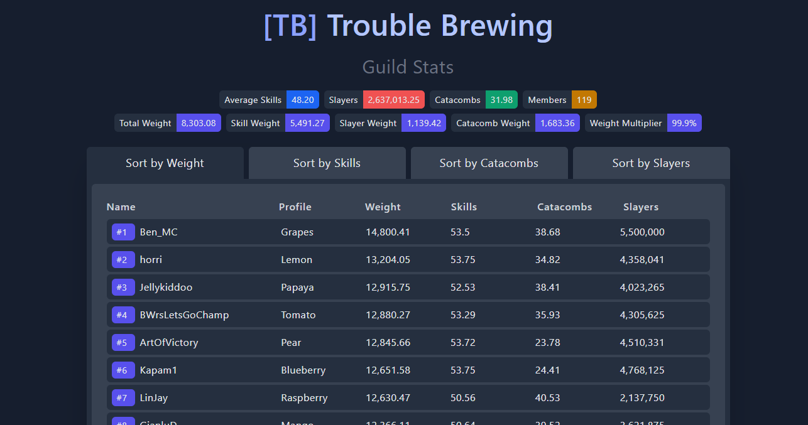

Hypixel Guild Scanner
=====================

A [VueJS](https://vuejs.org/) and [TailwindCSS](https://tailwindcss.com/) app that makes it easy to scan [Hypixel SkyBlock](https://hypixel.net/) guilds to get guild averages and guild player stats, this system utilizes the [Hypixel SkyBlock Facade](https://github.com/Senither/hypixel-skyblock-facade) API to make fetching player information a lot easier.

## Table of Content

- [Installation using NodeJS](#installation-using-nodejs)
  - [Prerequisites](#prerequisites)
  - [Setup Guide](#setup-guide)
  - [Using Mix versioning](#using-mix-versioning)
- [Installation using Docker](#installation-using-docker)
  - [Prerequisites](#prerequisites-1)
  - [Setup Guide](#setup-guide-1)
- [License](#license)

## Installation using NodeJS

### Prerequisites

> Items with a * in front of their name are only required if you want you use the Laravel [Mix versioning](https://laravel-mix.com/docs/5.0/versioning). 

- NodeJS >= 14
- *PHP >= 7.4
- *Composer >= 2

### Setup Guide

To get started, clone down the repository using:

    git clone https://github.com/Senither/hypixel-skyblock-guild-scanner.git

Next go into the `hypixel-skyblock-guild-scanner` folder and install all the dependencies using Yarn or NPM.

    yarn install

    npm install

When all the dependencies have been installed you're now ready to build all the assets for production, to do this run:

    yarn prod

You can also build the assets for development mode by using `yarn dev` or `yarn watch`, when building for production you'll get minified JS and CSS files, and all unused [TailwindCSS](https://tailwindcss.com/) styles will automatically be removed from the CSS file to lower the file sizes, when building for development then all styles will be included, and non of the code will be minified, additionally a source map for the code will also be generated to help make it easier to debug errors in the Vue components during development.

### Using Mix versioning

Using mix versioning isn't required to setup and use the project, however it's a nice to have feature when hosting the site behind services like [CloudFlare](https://www.cloudflare.com/) that might cache the CSS and JS files and you want the changes you make to the app to take effect right as you make them.

> Note: To use this feature you must have PHP 7.3+ installed, as-well-as [Composer](https://getcomposer.org/).

If you have PHP 7.3+ and Composer installed you can install the composer dependencies and setup the autoloader by running:

    composer install

That will generate the Composer `vendor/` directory and ensure that all the files needed by PHP is generated and autoloaded, from there you can open the `index.php` file in any PHP server to serve the site.

## Installation using Docker

### Prerequisites

- Docker >= 20

_Older versions may also work, but have not been tested._

### Setup Guide

Running the app via Docker is made easy using [Docker Compose](https://docs.docker.com/compose/), to get started first clone down the repository:

    git clone https://github.com/Senither/hypixel-skyblock-guild-scanner.git

Next go into the `hypixel-skyblock-guild-scanner` folder and start the app.

    docker-compose up -d

The first time the app starts it will build all the containers which may take some time, after it's done it should startup both the guild scanner listening on port `8080`, and the [facade API](https://github.com/Senither/hypixel-skyblock-facade) listening on port `9281` which the guild scanner depends on for loading player information, you can customize either of these ports by editing the `docker-compose.yml` file, or setting the `APP_PORT` and `API_PORT` environment variables.

And you're done!

## License

Hypixel Guild Scanner is open-sourced software licensed under the [MIT License](https://opensource.org/licenses/MIT).
